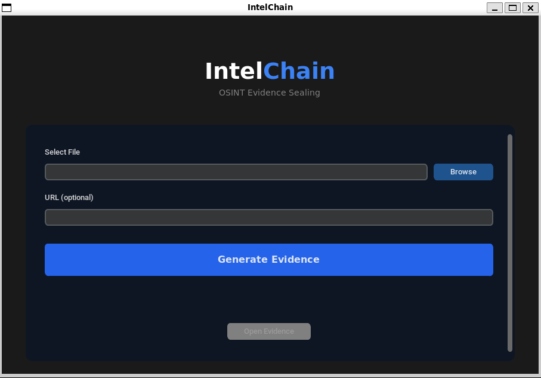
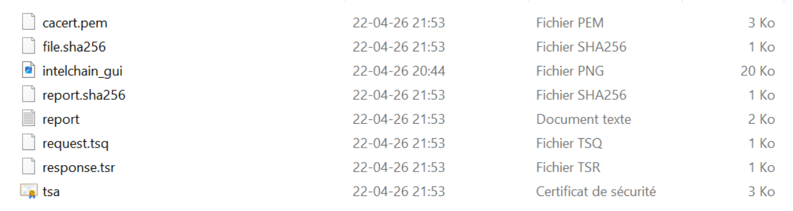

#  IntelChain — OSINT Evidence Sealing Tool

IntelChain is a lightweight forensic-oriented tool designed to preserve digital evidence integrity using SHA256 hashing and RFC3161 trusted timestamping.

IntelChain follows a forensic-oriented methodology aligned with digital evidence handling practices, ensuring traceability, integrity, and verifiability.

Designed for investigators, analysts, and OSINT practitioners.

---
## IntelChain Interface

<p align="center">
  
</p>

## Installation

```bash
git clone https://github.com/your-username/intelchain.git
cd intelchain
chmod +x install.sh
./install.sh
##  Quick Start

```bash
python3 intelchain.py file.jpg
```
---

## Evidence Integrity Workflow

1. SHA256 hashing of the file
2. RFC3161 timestamp request (TSA)
3. Timestamp response validation
4. Forensic report generation

---

## Example Output

### Evidence Package

Generated files:

```text id="e4l5tq"
cacert.pem
file.sha256
report.txt
report.sha256
request.tsq
response.tsr
tsa.crt
```

### Report Preview

```text id="m8k2z1"
=== INTELCHAIN REPORT ===

Case ID: 2026-04-22_21-53-12
Date: 2026-04-22 21:53:13
ISO 8601: 2026-04-22T21:53:13

=== Integrity ===

SHA256: 07e7d54959686c70dfb48eb2c3c75ec4422d68477df4937e3b97446515ce9248

=== Timestamp Authority ===

TSA Status: Granted
TSA Timestamp: Apr 22 19:53:14 2026 GMT
Authority: freetsa.org
Standard: RFC3161

=== Verification ===

Result: VALID (cryptographic verification successful)

```
## Generated Files

<p align="center">
  
</p>

##  Why IntelChain

In OSINT investigations, preserving the integrity and timestamp of collected evidence is critical.

IntelChain provides a simple and reliable way to:

* Prove data integrity (SHA256)
* Establish trusted time of collection (RFC3161)
* Generate verifiable forensic reports

This ensures that collected evidence can be validated and trusted over time.

---

##  Features

- SHA256 hashing (file and report integrity)
- RFC3161 trusted timestamping (FreeTSA)
- Structured forensic report generation (integrity, timestamp, verification)
- Evidence packaging (RFC3161 timestamp data, report, associated hashes)
- Optional GUI (CustomTkinter)

---

##  Requirements

Linux / WSL environment with:

- Python 3 (3.8+ recommended)
- OpenSSL (for RFC3161 timestamping)
- curl (for TSA communication)

---

##  Usage

```bash
python3 intelchain.py <file> [url]
```

GUI:

```bash
python3 gui.py
```

---

##  Output

Evidence folder generated:

* file.sha256
* request.tsq
* response.tsr
* report.txt
* report.sha256

---

##  Notes

* Designed for Linux / WSL
* Windows execution not supported natively

---

##  Author

IntelChain
